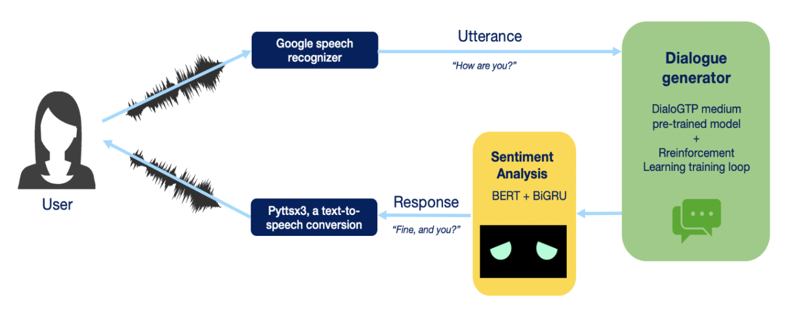
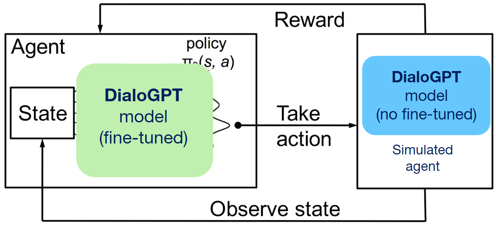
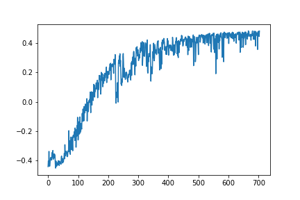
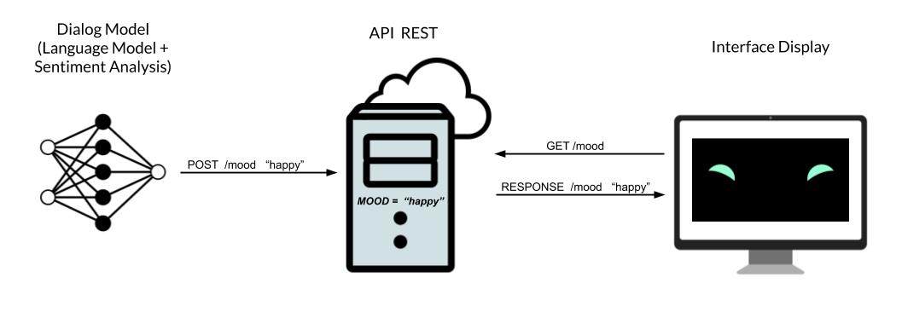
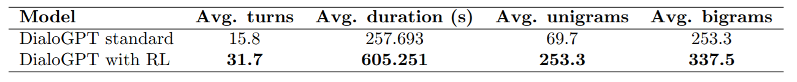

# Deep Reinforcement Learning Open-domain chatbot
Master in Artificial Intelligence - UPC: Cognitive Interaction with Robots (CIR) Final Project


**Authors: Gonzalo Recio and Jana Reventós**

In this repository we present an  open-domain  conversational  chatbot  that  is  able  to  interact  with  users by voice through a graphical interface.  Many conversational chatbots lack of engagement, are short-sighted and tend to generate incoherent or repetitive responses making the interaction last for a short period.  To solve this, we propose a deep reinforcement learning approach to train its core language model  (GPT  Transformer)  in  order  to  improve  the  long-term  performance. 

## Chatbot
The chatbot mainly consists of a generative language model (DialoGPT fine-tuned with RL) to produce sentences, and a sentiment analysis model (BERT+GRU) to predict sentiment of the input and output sentences.

The proposed design of the chatbot workflow starts the user producing an utterance, then the system converts the user speech to text, and this text is fed to the the dialogue generation trained with RL. The dialogue generation predicts the most adequate answer, this response is analyzed by a sentiment analysis model to change the chatbot interface mood, finally, the engine converts the answer into speech which
is released to the user.




## Reinforcement Learning 
Neural models from conversational agents usually tend to be short-sighted, predicting utterances one at time getting stuck in an infinite loop of repetitive responses, therefore, they ignore the influence of future outcomes. Using RL can help to model the future reward of the chatbot responses.

We aim to maximize the long-term reward, that is why we think that the success of the dialogue it is achieved by the contribution of three major factors, based on [Li et al., 2016]:
The rewards:
- Ease of answering (r1):  a turn generated by the chatbot should be ease to respond to, avoiding dull responses. 

- Information flow (r2): chatbot able to contribute new information to keep the dialogue moving and avoid repetitive response.

- Repetition avoidance (r3): we want the chatbot to avoid repeating the sentences of the other user. 


The core idea behind our cognitive model approach is to simulate the process of two agents taking turns talking with each other. Both agents are based on the DialGPT language model, however, one of them is coded in a way that explores the state-action space and tries to maximize the reward function, while the other one is frozen (simulated agent). The whole RL training loop overview is shown below. We ran 1000 episodes (dialogue simulations) and observed that the model improves the rewards by converging around episode 800:





## Architecture and interface
The chatbot can also can display a friendly interface to show some expressions and gestures such as happiness, sadness, confusion and blinking (web-based GUI to display it in any device with web browser). This interface takes the output of the sentiment analysis model to choose the adequate expression to show.




## Main requirements for execution
Models:
```
pip install torch
pip install transformers     (for DialoGPT model)
```
Interface (speech recognition and synthesis, translation):  
```
pip install SpeechRecognition
pip install google-speech
pip install google-trans-new
```

## Code

To run the chatbot run `python main.py` on a terminal. This command automatically opens de chatbot interface. Web-based interface of the chatbot interface can be found at: https://gonzalorecio.com/chatbot/robot.html

The code to train the model with Deep Reinforcement Learning is located at `seq2seq/seq2seq-RL.ipynb`.

## Model weights

Model weights and checkpoints from RL traning and BERT-GRU for sentiment analysis are located at https://drive.google.com/drive/folders/17BZD6kc2ATJf26cEjSYMLoXdEHp6CTdc?usp=sharing.


## Results

In the directiory `results` there are the quantitative results of the interactions and the output dialogues. Inside folder `questionnaire` we can find the results of the participant questionnaires.

Qualitatively, if we stop the RL process before degrading the model loses language understanding and starts generating non-sense sequences, we can see that the expressiveness of the generated utterance is much richier (episode 1 vs. 200).


Furthermore, this increate of expressivity is also reflected in user engagement as observed in the experiments carried out with real users, where the average number of dialogue turns, duration of the convesation and number of unigrams and bigrams are significantly greater with our model trained with RL, compared to baseline DialoGPT:


